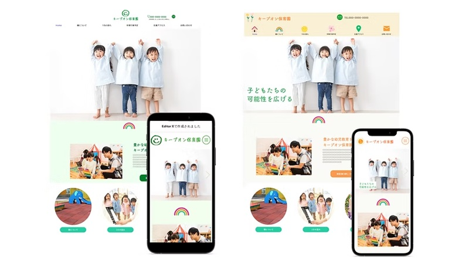

# 画像差し込みガイド｜キープオン HP制作サイト

このサイトには、あとから画像を入れるための**プレースホルダー枠（点線のグレー枠）**を各所に設置しています。
枠の中に「**何の画像か / 推奨サイズ / 保存パス**」を表示しているので、その通りに画像を用意し、保存して差し替えるだけで反映されます。

---

## 1. 画像の保存先（フォルダ構成）

すべて `assets/images/` の中に、用途別フォルダで保存してください。

```
assets/images/
├── common/      … ロゴ・OGP画像など共通
├── hero/        … トップのメインビジュアル（任意）
├── features/    … 3つの特徴のイラスト（任意）
├── courses/     … トップのコース紹介イメージ
├── service/     … サービス・料金ページの説明画像
├── templates/   … テンプレート一覧のサムネイル
├── works/       … 制作事例のサイトSS・Before/After
├── about/       … 代表・スタッフ写真
└── contact/     … LINE QRコード
```

---

## 2. 画像スロット一覧（全ページ）

| ページ | スロット内容 | 推奨サイズ | 保存パス |
|--------|------------|-----------|---------|
| 共通 | ロゴ（現在はSVGの仮ロゴ） | 横長 / 透過PNG or SVG | `assets/images/common/logo.svg` |
| 共通 | OGP画像（SNSシェア用・任意） | 1200×630px | `assets/images/common/ogp.png` |
| トップ | コース「テンプレート」完成イメージ | 800×450px | `assets/images/courses/course-template.jpg` |
| トップ | コース「オーダーメイド」完成イメージ | 800×450px | `assets/images/courses/course-custom.jpg` |
| トップ | 事例：そよかぜ保育園 SS | 800×500px | `assets/images/works/work-soyokaze.jpg` |
| トップ | 事例：うたのおとピアノ教室 SS | 800×500px | `assets/images/works/work-utanooto.jpg` |
| トップ | 事例：八尾キッズSC SS | 800×500px | `assets/images/works/work-yaokids.jpg` |
| トップ | スタッフ写真（丸抜き） | 400×400px | `assets/images/about/staff.jpg` |
| サービス | テンプレート選択画面イメージ | 800×600px | `assets/images/service/template-detail.jpg` |
| サービス | オーダーメイド制作イメージ | 800×600px | `assets/images/service/custom-detail.jpg` |
| テンプレート | 各テンプレSS（ナチュラル×2） | 800×500px | `assets/images/templates/tpl-natural-01〜02.jpg` |
| テンプレート | 各テンプレSS（ポップ×2） | 800×500px | `assets/images/templates/tpl-pop-01〜02.jpg` |
| テンプレート | 各テンプレSS（信頼×2） | 800×500px | `assets/images/templates/tpl-trust-01〜02.jpg` |
| 制作事例 | 事例サムネ×6 | 800×500px | `assets/images/works/work-*.jpg` |
| 事例詳細 | Before（旧サイト/HP無し） | 800×600px | `assets/images/works/detail-soyokaze-before.jpg` |
| 事例詳細 | After（完成サイトSS） | 800×600px | `assets/images/works/detail-soyokaze-after.jpg` |
| 会社概要 | 代表写真 | 600×600px（正方形） | `assets/images/about/ceo.jpg` |
| 会社概要 | Googleマップ埋め込み | iframe差し替え | （下記4参照） |
| お問い合わせ | LINE公式 QRコード | 600×600px | `assets/images/contact/line-qr.png` |

> ※「任意」のスロット（hero / features）は、現在CSSで作ったイラスト風表現で成立しています。写真に差し替えたい場合のみ用意してください。

---

## 3. 差し替え方法（共通）

枠（`<figure class="img-ph">…</figure>`）を、次の `` に置き換えるだけです。

```html
<!-- 置き換え前（プレースホルダー） -->
<figure class="img-ph" style="aspect-ratio:16/9"> … </figure>

<!-- 置き換え後 -->

```

ポイント
- `alt` には画像の内容を日本語で（SEO・アクセシビリティ向上）
- `loading="lazy"` を付けると表示が速くなります
- `cover`（枠いっぱい）系は、置き換え後の `` に `style="width:100%;height:100%;object-fit:cover"` を付けてください
- 画像は **WebP または JPG**、容量は1枚あたり**200KB以下**が目安

---

## 4. Googleマップ（会社概要）

`about.html` の地図プレースホルダーを、Googleマップの埋め込みに置き換えます。
Googleマップで住所検索 →「共有」→「地図を埋め込む」→ iframeコードをコピーし、`<figure class="img-ph">…</figure>` ごと差し替えてください。`class="map-embed"` を iframe に付けると枠が整います。

---

## 5. ロゴ・LINE・フォームの設定（画像以外）

- **ロゴ**：現在は仮のSVGロゴ（[layout.js](assets/js/layout.js) の `LOGO_SVG`）。正式ロゴができたら、`assets/images/common/logo.svg` を用意し `LOGO_SVG` を `` に差し替え。
- **LINEのURL**：[config.js](assets/js/config.js) の `LINE_URL` に公式LINEの友だち追加URL（例 `https://lin.ee/xxxx`）を設定。サイト中の全LINEボタンに自動反映されます。
- **フォーム送信先**：[config.js](assets/js/config.js) の `FORM_ENDPOINT` を設定すると実際に送信されます（未設定の間は「送信完了」表示のデモ動作）。
  - かんたんな方法：[Formspree](https://formspree.io/) で無料登録 → フォーム作成 → `https://formspree.io/f/xxxxxxx` を `FORM_ENDPOINT` に貼り付け。
